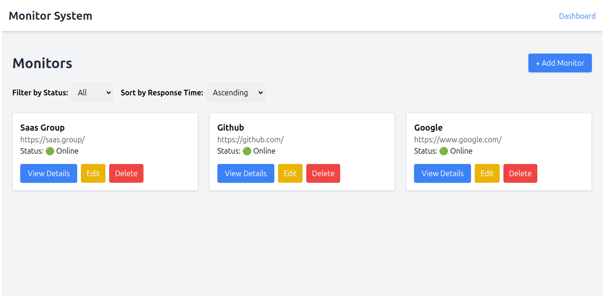
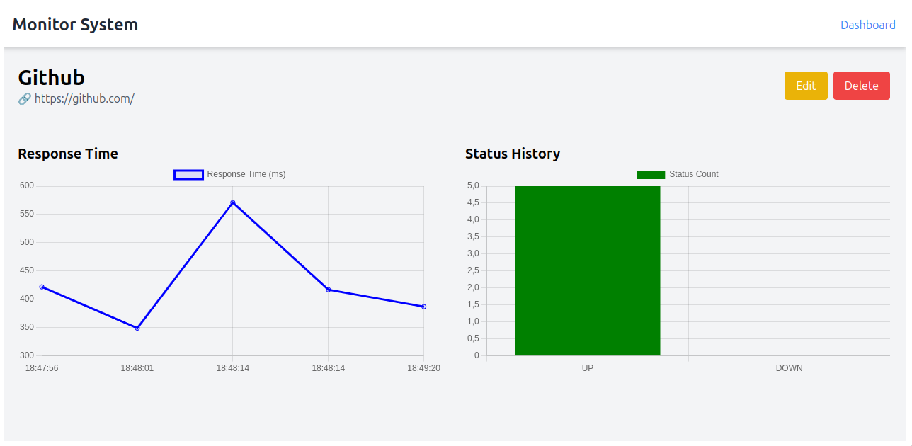

# 🌐 URL Health Monitor - Backend & Frontend
This is a **URL health monitoring system** that allows users to track website availability, response times, and uptime percentage.  

The system consists of:
- **Backend (Rails API):** Manages monitors, performs periodic health checks, and processes background jobs with Sidekiq.  
- **Frontend (React):** Provides a dashboard to visualize and manage monitored URLs.

## Tech Stack

### Backend (Rails API)

- Ruby on Rails 7+ 
- PostgreSQL 
- Redis + Sidekiq
- RSpec

### Frontend (React)

- React 
- Tailwind CSS 
- Chart.js / Recharts

## Features

✅ **Monitor Websites** (CRUD for Site Monitors)  
✅ **Automated Background Health Checks** (Sidekiq & Redis)  
✅ **Real-time Updates** (Polling to fetch latest statuses)  
✅ **Filtering & Sorting** (Status-based filtering, response time sorting)  
✅ **Graphs & Charts** (Status History & Response Time Visualizations)  
✅ **Authentication (Basic Auth)**  
✅ **Containerized Deployment (Docker + Docker Compose)**  
✅ **Tested Backend (RSpec)**  


## Setup Instructions

### **Prerequisites**

Ensure you have:

- **Docker** installed

### **Clone the Repository**

```sh
git clone https://github.com/marquesaline/url-health-monitor.git
cd url-health-monitor
```

### Set Up Environment Variables

#### Backend (`.env` in root directory)

Create a `.env` file based on .env.example and configure the required variables:

```
cp .env.example .env
```
#### Frontend (`.env` inside `frontend/`)

Navigate to the `frontend/` folder and create the `.env` file:

```
cp frontend/.env.example frontend/.env
```

### Start the Full Application (Backend + Frontend)

Run:

```
docker-compose up -d --build
```

This will start:

- Frontend (http://localhost:5173)
- Rails API (http://localhost:3000)
- PostgreSQL Database
- Redis (for Sidekiq)
- Sidekiq Worker (to process background jobs)

### Running Tests

To run all tests:

```
docker-compose up test
```

## User Interface

### **📊 Dashboard - Overview of Monitored Websites**

The **Dashboard** displays all monitored URLs with their statuses (**UP/DOWN**), response times, and filtering options.  

Users can:

- **Add new monitors** to track websites.
- **Filter by status** (`UP` / `DOWN`).
- **Sort monitors** by response time.
- **Access individual monitor details.**



### **📈 Monitor Details - Status & Performance Insights**

Each monitor has a **detailed page** showing:
- **Response time trends** over time.
- **History of status checks** (when it was `UP` or `DOWN`).
- **Edit or delete** the monitor directly.

